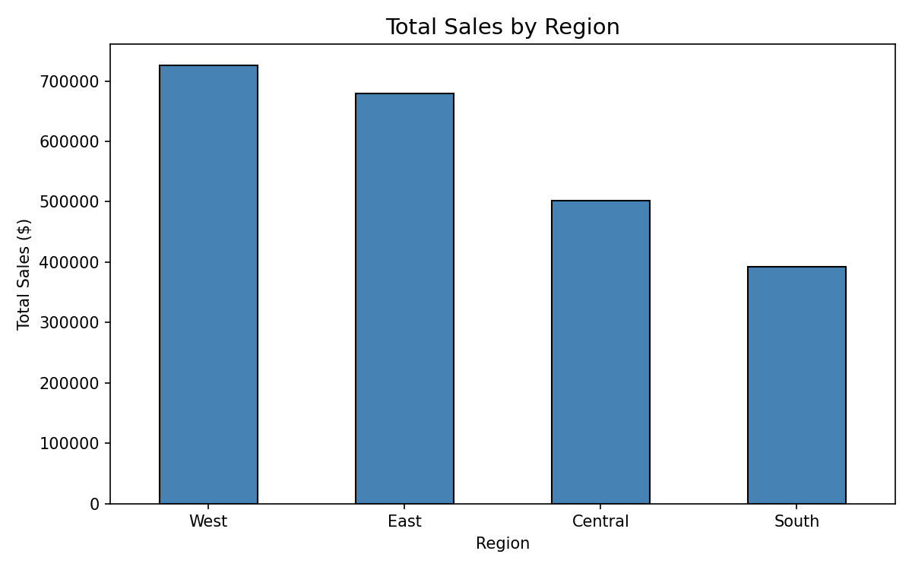
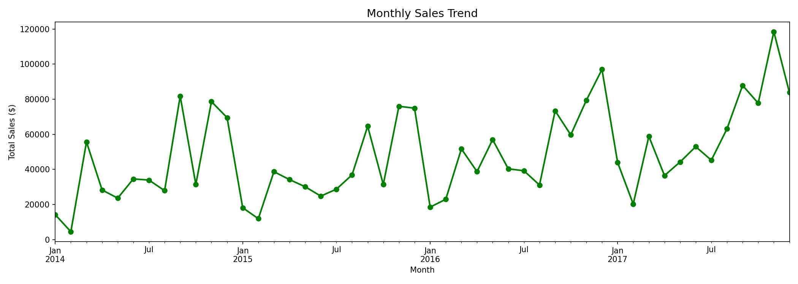
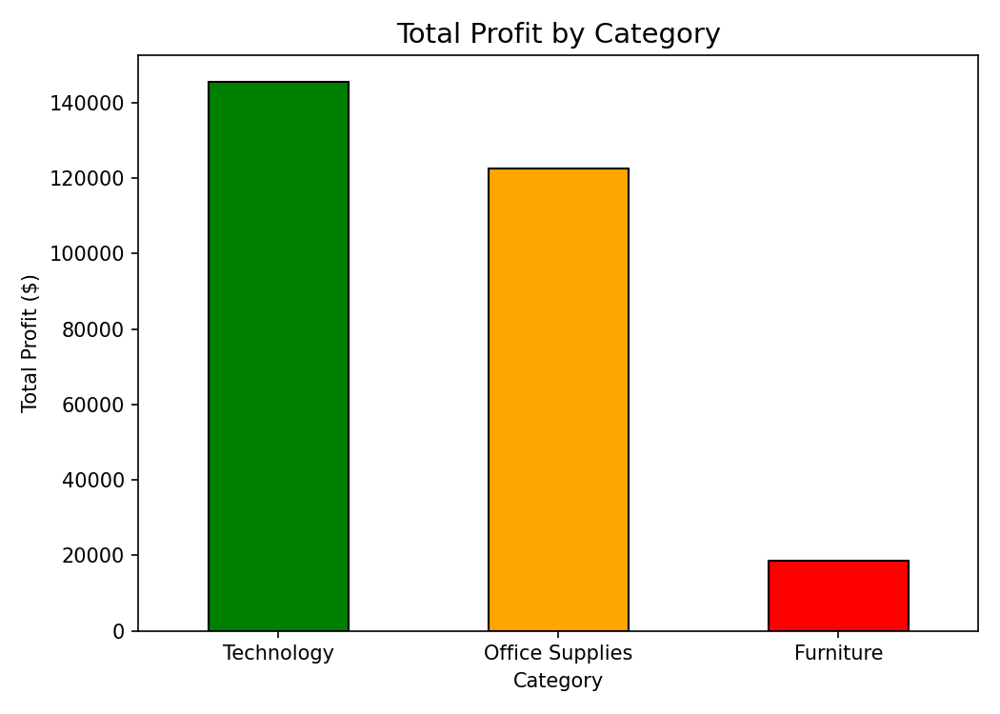
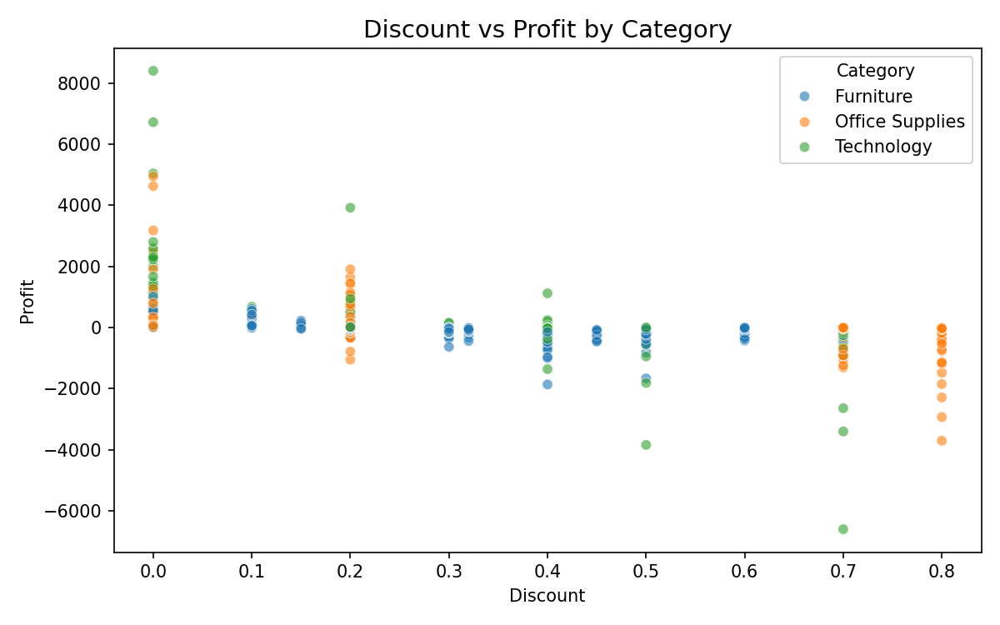
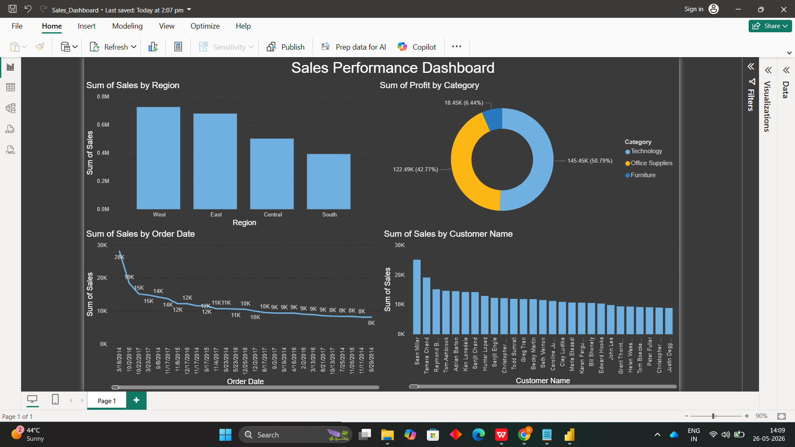

# 🛒 Sales Performance Analysis | Superstore Dataset

## 📊 Project Overview
Analyzed 9,994 retail transactions from a US Superstore to identify 
sales trends, regional performance, and profitability insights 
across 4 years (2014-2017).

## 🔧 Tools Used
->> **MySQL** — Data querying and analysis
-> **Python** — Exploratory data analysis and visualization
-> **Power BI** — Interactive dashboard
-> **Excel** — Data cleaning

## Project Structure
-> `queries.sql` — 5 SQL queries for business insights
-> `sales_analysis.ipynb` — Python EDA and charts
-> `Sales_Dashboard.pbix` — Power BI dashboard
-> `Sales_Dashboard.pdf` — Exported dashboard

## 🔍 Key Insights
-> **West region** generates highest revenue at $725,457
-> **Technology** is the most profitable category
-> Sales show consistent growth from 2014 to 2017
-> High discounts directly reduce profit margins

## 📈 Visualizations

## 💡 Business Recommendations
- Focus marketing budget on West and East regions
- Reduce discounts above 20% as they cause losses
- Invest more in Technology category for higher profits
